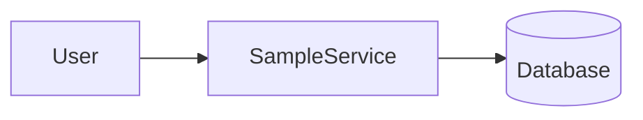
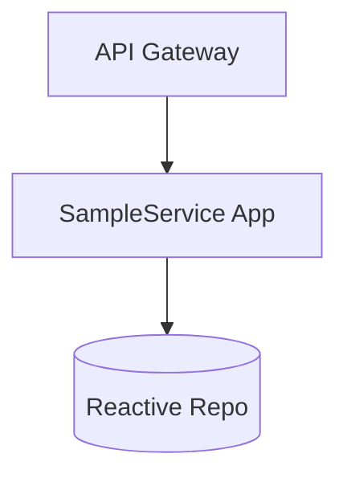
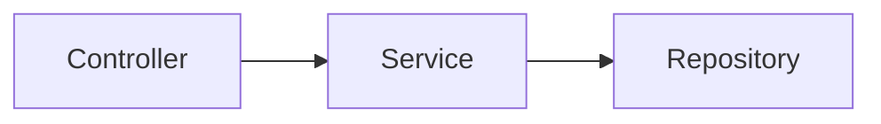
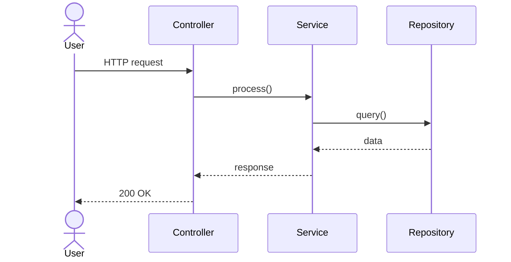

# High Level Design: pr-4

- Traceability: REQ-PR-4-001 -> HLD-PR-4-001
- Source PR: #4
- Source Branch: sumncc-patch-1
- Input Paths: docs/generated/requirements
- Diagram Format: mermaid

## System Context

## Container Diagram

## Component Diagram

## Key Sequence

