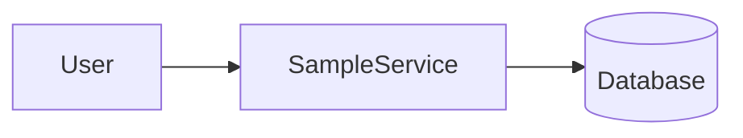
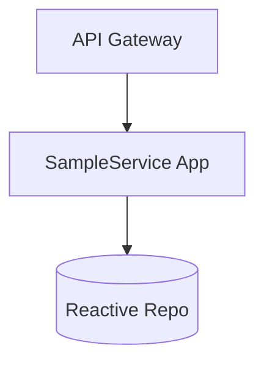
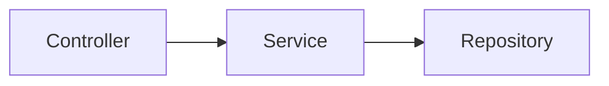
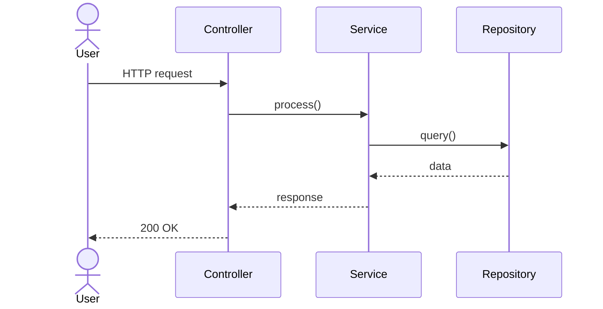

# High Level Design: pr-7

- Traceability: REQ-PR-7-001 -> HLD-PR-7-001
- Source PR: #7
- Source Branch: sumncc-patch-2
- Input Paths: docs/generated/requirements
- Diagram Format: mermaid

## System Context

## Container Diagram

## Component Diagram

## Key Sequence

