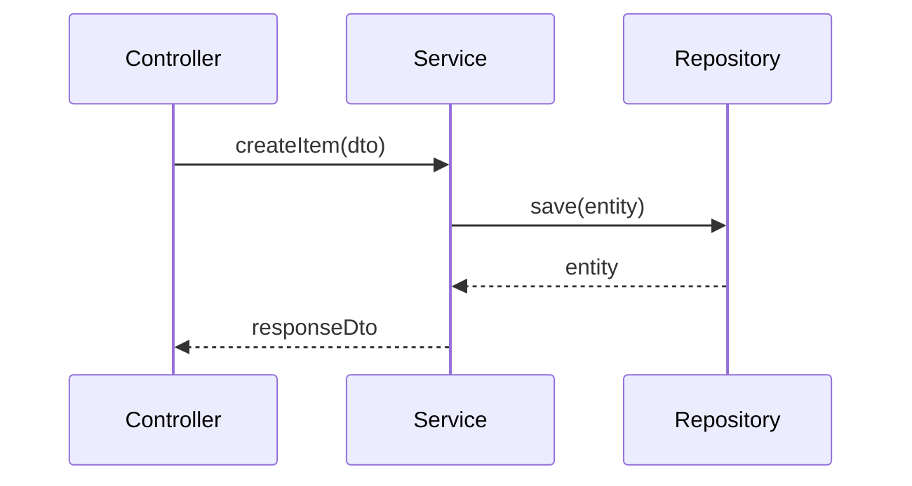

# Low Level Design: pr-5

- Traceability: HLD-PR-5-001 -> LLD-PR-5-001
- Source PR: #5
- Source Branch: auto/hld/pr-4
- Input Paths: docs/generated/hld

## Modules
- controller
- service
- repository
- dto
- mapper

## API Contract
- GET /api/v1/items/{id}
- POST /api/v1/items

## Sequence

